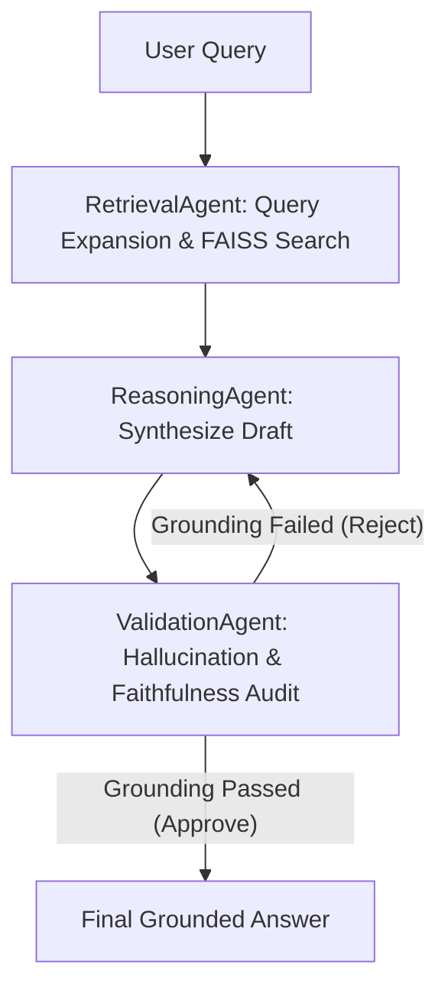

# Agentic Research System

A state-of-the-art **Retrieval-Augmented Generation (RAG)** research workspace powered by **LangGraph multi-agent orchestration** and **RAGAS compliance auditing**. 

It features a high-fidelity React frontend dashboard with real-time graph execution playbacks, a robust FastAPI backend, and an intelligent client-side fallback simulation for offline/static hosting (such as GitHub Pages).

---

## Key Features

* **Multi-Agent Orchestration (LangGraph)**:
  * **RetrievalAgent**: Handles FAISS query matching and dynamic query expansion.
  * **ReasoningAgent**: Synthesizes and refines grounded responses.
  * **ValidationAgent**: Audits drafts for hallucinations and enforces faithfulness, triggering self-correction routing loops back to reasoning if claims are ungrounded.
* **FAISS Vector Database**: Fast local chunking, embedding, and semantic similarity searching.
* **Premium Dark-Theme Interface**: A sleek React dashboard built with Vite, showcasing real-time trace playbacks and interactive SVG flowcharts representing agent states.
* **RAGAS Compliance Auditing**: Interactive Evaluation Studio running batch audits of faithfulness, answer relevance, and context precision.
* **Hybrid Execution Modes**: Seamless transition between Live LLM Engine (OpenAI/Anthropic) and Local Demo/Simulation fallback.

---

## Architecture Flow



---

## Getting Started

### Prerequisites
* Python 3.10+
* Node.js 18+

### Setup & Running the Backend
1. **Navigate to the backend directory**:
   ```bash
   cd backend
   ```
2. **Create a virtual environment and activate it**:
   ```bash
   python3 -m venv venv
   source venv/bin/activate
   ```
3. **Install dependencies**:
   ```bash
   pip install -r requirements.txt
   ```
4. **Run the backend**:
   To run imports correctly, execute from the project root folder:
   ```bash
   cd ..
   python3 -m backend.main
   ```
   *The FastAPI server will start on `http://localhost:8000`.*

---

### Setup & Running the Frontend
1. **Navigate to the frontend directory**:
   ```bash
   cd frontend
   ```
2. **Install dependencies**:
   ```bash
   npm install
   ```
3. **Run the development server**:
   ```bash
   npm run dev
   ```
   *The dashboard will run on `http://localhost:5173`.*

---

## Offline & Demo Mode

If the backend is not running, the frontend automatically enters **Offline Fallback / Demo Mode**. 
* Supports interactive document management simulations.
* Employs a smart rule-based simulator matching key search terms (e.g., *Deep Learning, RAG, LangGraph, Hallucination, Evaluation, Scheduling*) to run realistic self-correction loops and return accurate final grounded answers in the UI.
* Accessible live at: **[https://Zura16.github.io/Agentic-Research-System](https://Zura16.github.io/Agentic-Research-System)**
